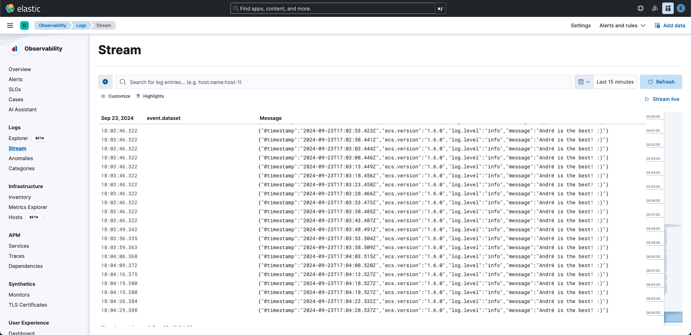

# ELK Stack

Simple setup based on [elastic search with docker-compose](https://www.elastic.co/guide/en/elasticsearch/reference/current/docker.html#docker-compose-file).

1. How to run

```bash
docker-compose up -d
```

After that access Kibana at [http://localhost:5601](http://localhost:5601).

- username: `elastic`
- password: `elastic123`

2. How to stop

```bash
docker compose down -v
```

3. Golang logs on Kibana

