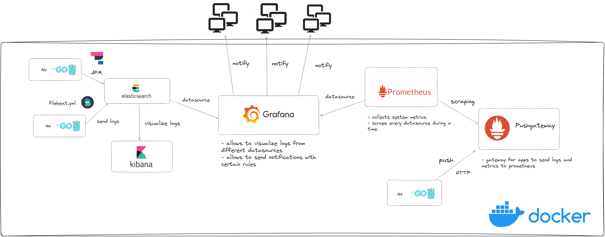

# 1 Parte

Foi-se proposto aos alunos desenvolver serviços piloto para testar e aprofundar os conhecimentos nas seguintes tecnologias:

- ELK (Elasticsearch + Logstash + Kibana)
- Prometheus
- Grafana
- Docker
- Terraform

O objetivo desta primeira fase é implementar instrumentação utilizando as ferramentas referidas, o diagrama abaixo explica o processo:

Neste momento o grupo de alunos está a tentar migrar os serviços para o Microsoft Azure, para ficar tudo totalmente na cloud.

# 2 Parte

Após os alunos explorarem as ferramentas é se esperado aplicar métricas nos sistemas de instrumentação da Cachapuz.

